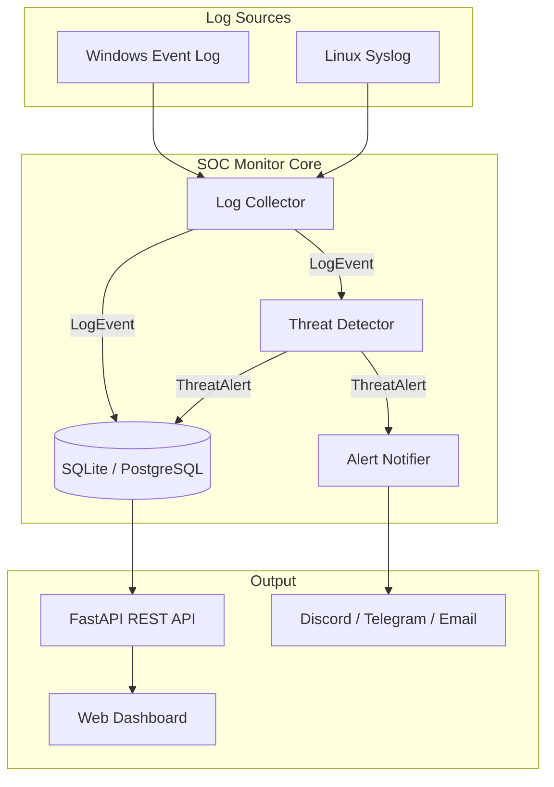

# SOC Monitor — Security Operations Center

<p align="center">
  <strong>Πλατφόρμα παρακολούθησης ασφαλείας και ανίχνευσης απειλών σε πραγματικό χρόνο</strong><br>
  Windows Event Logs · Linux Syslog · Rule-based Detection · Multi-channel Alerts · Web Dashboard
</p>

---

## Περιεχόμενα

- [Επισκόπηση](#επισκόπηση)
- [Αρχιτεκτονική](#αρχιτεκτονική)
- [Δομή Project](#δομή-project)
- [Εγκατάσταση](#εγκατάσταση)
- [Εκκίνηση](#εκκίνηση)
- [Dashboard & UX](#dashboard--ux)
- [Ροή Δεδομένων](#ροή-δεδομένων)
- [Κανόνες Ανίχνευσης](#κανόνες-ανίχνευσης)
- [Ειδοποιήσεις](#ειδοποιήσεις)
- [REST API](#rest-api)
- [Ρυθμίσεις](#ρυθμίσεις)
- [Δεδομένα Runtime (Παράδειγμα)](#δεδομένα-runtime-παράδειγμα)
- [Troubleshooting](#troubleshooting)

---

## Επισκόπηση

Το **SOC Monitor** είναι ένα ελαφρύ, αυτοτελές Security Operations Center framework γραμμένο σε Python. Συλλέγει αυτόματα logs από το λειτουργικό σύστημα (Windows ή Linux), τα αποθηκεύει σε βάση δεδομένων, αναλύει συμβάντα με rule-based detection engine και εκδίδει ειδοποιήσεις ασφαλείας μέσω Discord, Telegram ή Email.

### Τι κάνει

| Λειτουργία | Περιγραφή |
|-----------|-----------|
| **Log Collection** | Αυτόματη συλλογή από Windows Event Log (Security, System, Application) ή Linux syslog (`auth.log`, `syslog`, `secure`) |
| **Threat Detection** | Ανίχνευση brute force, failed logins, privilege escalation, suspicious processes, audit log tampering |
| **Persistence** | Αποθήκευση σε SQLite (default) ή PostgreSQL με SHA-256 deduplication |
| **Alerting** | Push notifications σε Discord, Telegram, SMTP Email |
| **Dashboard** | Web UI με KPIs, charts, πίνακες alerts/events, system status |
| **REST API** | Πλήρες JSON API + Swagger docs στο `/docs` |

### Tech Stack

- **Python 3.10+** · FastAPI · Uvicorn · SQLite/PostgreSQL
- **Windows:** pywin32 (Event Log API)
- **Linux:** Native file tailing για syslog
- **Frontend:** Chart.js · Inter font · Responsive dark theme

---

## Αρχιτεκτονική



### Pipeline ανά συμβάν

1. Ο **Collector** διαβάζει έως 100 νέα events ανά κύκλο (κάθε 10 δευτερόλεπτα)
2. Κάθε event μετατρέπεται σε ενοποιημένο `LogEvent` με SHA-256 hash
3. Η **Database** αποθηκεύει το event (αγνοεί duplicates)
4. Ο **ThreatDetector** εκτελεί κανόνες ανίχνευσης
5. Αν εντοπιστεί απειλή → αποθήκευση alert + αποστολή ειδοποίησης
6. Το **Dashboard** ανανεώνεται κάθε 30 δευτερόλεπτα

---

## Δομή Project

```
SOC Monitoring & Threat Detection Framework/
├── main.py                      # Entry point — orchestrator
├── requirements.txt             # Python dependencies
├── .env.example                 # Πρότυπο ρυθμίσεων
├── soc_monitor.db               # SQLite database (δημιουργείται αυτόματα)
├── soc_monitor.log              # Application log
│
├── config/
│   └── settings.py              # Configuration dataclasses + env loading
│
├── collectors/
│   ├── windows_collector.py     # Windows Event Log ingestion
│   └── linux_collector.py       # Linux syslog ingestion
│
├── analyzers/
│   └── threat_detector.py       # Threat detection rules
│
├── storage/
│   └── database.py              # SQLite/PostgreSQL persistence
│
├── alerts/
│   └── notifier.py              # Discord, Telegram, Email
│
└── api/
    ├── routes.py                # FastAPI endpoints
    └── dashboard.html           # Web dashboard UI
```

---

## Εγκατάσταση

### Προαπαιτούμενα

- Python 3.10 ή νεότερο
- **Windows:** Δικαιώματα Administrator για πρόσβαση στο Security Event Log
- **Linux:** Ανάγνωση αρχείων `/var/log/auth.log` (συνήθως root ή ομάδα `adm`)

### Βήματα

```powershell
# 1. Μετάβαση στον φάκελο του project
cd "C:\Users\usr1\Documents\SOC Monitoring & Threat Detection Framework"

# 2. Δημιουργία virtual environment
python -m venv venv
.\venv\Scripts\activate

# 3. Εγκατάσταση dependencies
pip install -r requirements.txt

# 4. (Προαιρετικό) Ρύθμιση ειδοποιήσεων
copy .env.example .env
# Επεξεργαστείτε το .env με τα credentials σας
```

---

## Εκκίνηση

```powershell
# Windows — εκτελέστε ως Administrator για πλήρη πρόσβαση
python main.py
```

Μετά την εκκίνηση θα δείτε:

```
==========================================================
  SOC Monitor — Security Operations Center
==========================================================
  Platform     : Windows
  Hostname       : DESKTOP-LSRQ070
  Database       : sqlite
  Poll Interval  : 10s
  Batch Size     : 100
----------------------------------------------------------
  Dashboard      : http://localhost:8080/dashboard
  API Docs       : http://localhost:8080/docs
  Health Check   : http://localhost:8080/api/health
  System Status  : http://localhost:8080/api/system/status
----------------------------------------------------------
  Notifications  : None (configure via .env)
  Note           : Run as Administrator for Security Event Log
==========================================================
```

### URLs

| URL | Περιγραφή |
|-----|-----------|
| `http://localhost:8080/dashboard` | Web Dashboard (κύρια διεπαφή) |
| `http://localhost:8080/docs` | Swagger API documentation |
| `http://localhost:8080/api/health` | Health check |
| `http://localhost:8080/api/system/status` | Runtime system status |

---

## Dashboard & UX

Το νέο dashboard προσφέρει επαγγελματική εμπειρία SOC analyst με:

### Ενότητες

| Tab | Περιεχόμενο |
|-----|-------------|
| **Επισκόπηση** | KPI cards, γράφημα events/ώρα, doughnut chart τύπων, Top Source IPs |
| **Ειδοποιήσεις** | Πίνακας alerts με φίλτρα (Όλα / Μη αναγνωρισμένα / Critical / High), ACK, modal λεπτομερειών |
| **Συμβάντα** | Πρόσφατα log events με φίλτρο τύπου |
| **Σύστημα** | Platform, uptime, collector status, notification channels, API reference |

### UX Features

- Dark theme με cyan accent (SOC-style)
- Sidebar navigation
- Auto-refresh κάθε 30 δευτερόλεπτα
- Toast notifications για ACK actions
- Empty states όταν δεν υπάρχουν δεδομένα
- Responsive layout (mobile-friendly)
- Live connection indicator (Online/Offline)
- Collector error warnings (π.χ. Security log privileges)

---

## Ροή Δεδομένων

### Windows Events

Ο collector παρακολουθεί 30+ Security Event IDs:

| Event ID | Τύπος |
|--------|-------|
| 4624 | Successful login |
| 4625 | Failed login |
| 4688 | Process created |
| 4672 | Special privileges assigned |
| 1102 | Audit log cleared |
| 4720 | User account created |
| 4740 | User account locked |

### Linux Events

Ανάλυση syslog γραμμών από `auth.log`, `syslog`, `secure`:

- `failed_login` — Αποτυχημένη SSH/authentication
- `successful_login` — Επιτυχής σύνδεση
- `sudo_command` / `sudo_failure` — Privilege escalation
- `invalid_user` — Άγνωστος χρήστης

### Database Schema

**`log_events`** — Όλα τα συλλεγμένα events
**`threat_alerts`** — Εντοπισμένες απειλές με severity (LOW→CRITICAL)
**`statistics`** — Aggregated stats (schema ready)

---

## Κανόνες Ανίχνευσης

| Κανόνας | Trigger | Severity | Threshold |
|---------|---------|----------|-----------|
| **Brute Force** | ≥10 failed logins από ίδιο IP | HIGH | 10 events / 60s |
| **Failed Logins** | ≥5 αποτυχίες για συγκεκριμένο user | MEDIUM/HIGH | 5 events / 300s |
| **Privilege Escalation** | sudo failure ή `USER=root` | LOW/MEDIUM | Per event |
| **Suspicious Process** | mimikatz, nmap, powershell -enc, κ.ά. | CRITICAL | Regex match |
| **Audit Log Cleared** | Windows Event 1102 | CRITICAL | Per event |

### Suspicious Process Patterns (25+)

```
mimikatz, pwdump, bloodhound, metasploit, nmap, hydra,
hashcat, netcat, psexec, powershell -enc, certutil -urlcache, ...
```

---

## Ειδοποιήσεις

Ρυθμίστε μέσω environment variables (δείτε `.env.example`):

```powershell
# Discord
$env:DISCORD_ENABLED="true"
$env:DISCORD_WEBHOOK="https://discord.com/api/webhooks/..."

# Telegram
$env:TELEGRAM_ENABLED="true"
$env:TELEGRAM_BOT_TOKEN="your-bot-token"
$env:TELEGRAM_CHAT_ID="your-chat-id"

# Email (SMTP)
$env:EMAIL_ENABLED="true"
$env:SMTP_USER="your@gmail.com"
$env:SMTP_PASSWORD="app-password"
```

Κάθε alert στέλνεται με:
- Τύπο απειλής & severity (με χρώμα/emoji)
- Hostname, Source IP, Target User
- Περιγραφή & event count
- Timestamp

---

## REST API

### Endpoints

| Method | Endpoint | Περιγραφή |
|--------|----------|-----------|
| `GET` | `/api/health` | Health check |
| `GET` | `/api/system/status` | Runtime status (uptime, collector, DB counts) |
| `GET` | `/api/stats?days=7` | Aggregated statistics |
| `GET` | `/api/alerts?limit=100` | Threat alerts |
| `POST` | `/api/alerts/acknowledge` | Acknowledge alert `{"alert_id": 1}` |
| `GET` | `/api/threats/summary?hours=24` | Threat summary |
| `GET` | `/api/events/recent?limit=50` | Recent log events |

### Παράδειγμα — Health Check

```json
{
  "status": "healthy",
  "timestamp": "2026-06-19T18:43:18.723000",
  "components": {
    "database": true,
    "detector": true,
    "notifier": true
  }
}
```

### Παράδειγμα — System Status

```json
{
  "success": true,
  "data": {
    "platform": "Windows",
    "hostname": "DESKTOP-LSRQ070",
    "uptime_seconds": 3600,
    "database_type": "sqlite",
    "collector_type": "Windows Event Log",
    "collector_active": true,
    "collector_channels": ["Security", "System", "Application"],
    "collector_errors": [
      "Cannot open event log Security: (1314, 'OpenEventLogW', '...')"
    ],
    "poll_interval": 10,
    "batch_size": 100,
    "total_events": 5,
    "total_alerts": 0,
    "notifications": {
      "discord": false,
      "telegram": false,
      "email": false
    }
  }
}
```

### Παράδειγμα — Statistics

```json
{
  "success": true,
  "data": {
    "total_events": 5,
    "events_by_type": {
      "event_0": 1,
      "event_10016": 1,
      "event_1014": 1,
      "event_25753": 1,
      "event_8224": 1
    },
    "alerts_by_severity": {},
    "top_source_ips": [],
    "events_per_hour": {
      "18": 5
    }
  }
}
```

---

## Ρυθμίσεις

### Environment Variables

| Μεταβλητή | Default | Περιγραφή |
|-----------|---------|-----------|
| `DB_TYPE` | `sqlite` | `sqlite` ή `postgresql` |
| `PG_HOST` | `localhost` | PostgreSQL host |
| `PG_PASSWORD` | `""` | PostgreSQL password |
| `DISCORD_ENABLED` | `false` | Ενεργοποίηση Discord |
| `DISCORD_WEBHOOK` | `""` | Discord webhook URL |
| `TELEGRAM_ENABLED` | `false` | Ενεργοποίηση Telegram |
| `TELEGRAM_BOT_TOKEN` | `""` | Bot token |
| `TELEGRAM_CHAT_ID` | `""` | Chat ID |
| `EMAIL_ENABLED` | `false` | Ενεργοποίηση Email |
| `SMTP_USER` | `""` | SMTP username |
| `SMTP_PASSWORD` | `""` | SMTP password |

### Code Defaults (`config/settings.py`)

| Ρύθμιση | Default |
|---------|---------|
| API Host/Port | `0.0.0.0:8080` |
| Poll Interval | 10 seconds |
| Batch Size | 100 events |
| Brute Force Threshold | 10 / 60s |
| Failed Login Threshold | 5 / 300s |
| Windows Channels | Security, System, Application |
| Linux Log Paths | auth.log, syslog, secure |

---

## Δεδομένα Runtime (Παράδειγμα)

Παρακάτω πραγματικά δεδομένα από εκτέλεση στο **DESKTOP-LSRQ070** (Windows 10):

### Στατιστικά Βάσης

| Μετρική | Τιμή |
|---------|------|
| Συνολικά Events | **5** |
| Συνολικά Alerts | **0** |
| Hostname | DESKTOP-LSRQ070 |
| Platform | Windows |

### Events ανά Τύπο

| Event Type | Count | Περιγραφή |
|------------|-------|-----------|
| `event_8224` | 1 | VSS service timeout |
| `event_10016` | 1 | DCOM permission (user: usr1) |
| `event_0` | 1 | SynTPEnhService session unlock |
| `event_1014` | 1 | DNS resolution failure |
| `event_25753` | 1 | System event |

### Πρόσφατο Event (παράδειγμα)

```json
{
  "id": 5,
  "timestamp": "2026-06-19 18:43:23",
  "source": "windows",
  "hostname": "DESKTOP-LSRQ070",
  "event_type": "event_8224",
  "event_id": 8224,
  "username": null,
  "source_ip": null,
  "message": "Η υπηρεσία VSS τερματίζεται λόγω υπέρβασης του χρονικού ορίου αδράνειας."
}
```

### Log Output (εκκίνηση)

```
2026-06-19 18:43:18 - INFO - Windows Event Log collector initialized
2026-06-19 18:43:18 - INFO - Starting SOC Monitor...
2026-06-19 18:43:18 - INFO - Collection thread started
2026-06-19 18:43:18 - INFO - Starting API server on 0.0.0.0:8080
2026-06-19 18:43:27 - INFO - Processed 2 events, generated 0 alerts
2026-06-19 18:43:42 - INFO - Processed 1 events, generated 0 alerts
```

> **Σημείωση:** Το Security Event Log απαιτεί Administrator privileges. Χωρίς αυτά, συλλέγονται μόνο System & Application events (βλ. Troubleshooting).

---

## Troubleshooting

### Security Event Log — Error 1314

```
Cannot open event log Security: (1314, 'OpenEventLogW', 'Το πρόγραμμα-πελάτης δεν διαθέτει κάποιο απαραίτητο δικαίωμα.')
```

**Λύση:** Εκτελέστε `python main.py` ως **Administrator** (δεξί κλικ → Run as administrator). Το dashboard εμφανίζει αυτό το warning στην ενότητα Σύστημα.

### Port 8080 already in use

```powershell
# Αλλάξτε port στο config/settings.py ή σταματήστε την υπάρχουσα διεργασία
netstat -ano | findstr :8080
```

### Δεν εμφανίζονται events στο Dashboard

1. Ελέγξτε ότι ο collector τρέχει (tab **Σύστημα** → Collector: Ενεργός)
2. Ελέγξτε το `soc_monitor.log` για errors
3. Στο Windows, τρέξτε ως Administrator
4. Περιμένετε 10–30 δευτερόλεπτα (poll interval + refresh)

### Notifications δεν στέλνονται

1. Επιβεβαιώστε `DISCORD_ENABLED=true` (ή Telegram/Email)
2. Ελέγξτε τα credentials στο `.env`
3. Δείτε το `soc_monitor.log` για notification errors

---

## License

MIT — Ελεύθερη χρήση για εκπαιδευτικούς και επαγγελματικούς σκοπούς SOC monitoring.

---

<p align="center">
  Built with Python · FastAPI · Chart.js<br>
  <strong>SOC Monitor v1.0</strong>
</p>
